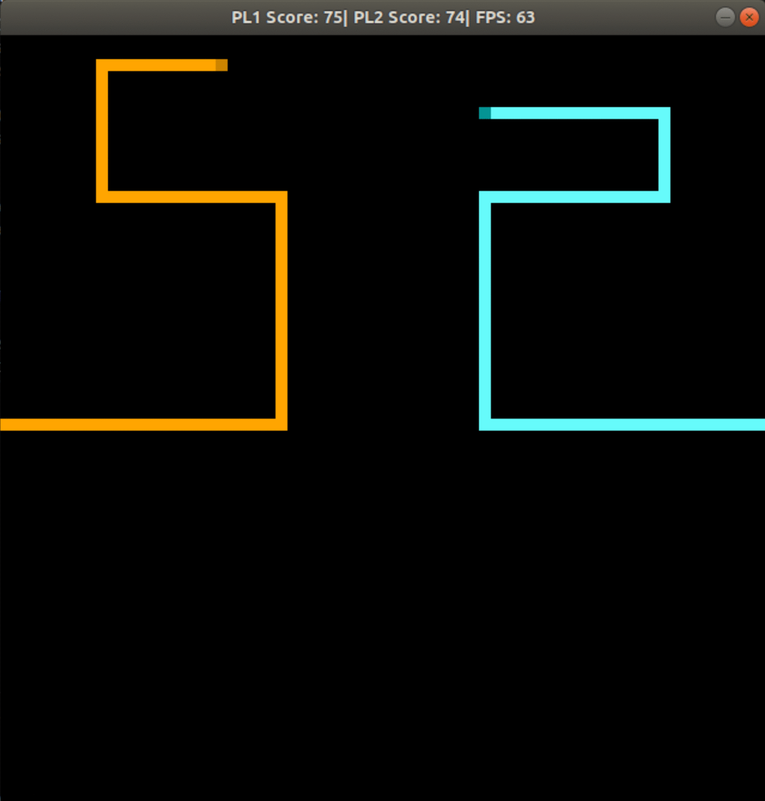

# CPPND: Capstone Tron-Legacy Game

This is a Tron movie based game in which the apponents use their vehicles called "Lightcycles" to occupy the maximum area of the arena possible while trying to constrain the apponent and make him move into his/her own light trail or the light trail left by your vehicle. The game is over when either of the aponent rams into a light trail.

## Dependencies for Running Locally
* cmake >= 3.7
  * All OSes: [click here for installation instructions](https://cmake.org/install/)
* make >= 4.1 (Linux, Mac), 3.81 (Windows)
  * Linux: make is installed by default on most Linux distros
  * Mac: [install Xcode command line tools to get make](https://developer.apple.com/xcode/features/)
  * Windows: [Click here for installation instructions](http://gnuwin32.sourceforge.net/packages/make.htm)
* SDL2 >= 2.0
  * All installation instructions can be found [here](https://wiki.libsdl.org/Installation)
  >Note that for Linux, an `apt` or `apt-get` installation is preferred to building from source. 
* gcc/g++ >= 5.4
  * Linux: gcc / g++ is installed by default on most Linux distros
  * Mac: same deal as make - [install Xcode command line tools](https://developer.apple.com/xcode/features/)
  * Windows: recommend using [MinGW](http://www.mingw.org/)

## Controls

### Player 1: Light Blue (Starts from right side of the screen)
* Arrow keys to steer the vehicle and '>' (greater than) to increase the speed and '<' (less than) to decrease the speed
* NOTE: No need to hold capslock key or shift key to get to the greater than and less than symbols

### Player 2: Light Orange (Starts from left side of the screen)
* W(up), S(down), A(left), D(right) keys to steer the vehicle and 'q' (quicker) to increase the speed and 'z' (snoozing) to decrease the speed

## Game preview

## Basic Build Instructions

1. Clone this repo.
2. Make a build directory in the top level directory: `mkdir build && cd build`
3. Compile: `cmake .. && make`
4. Run it: `./Tron`.
